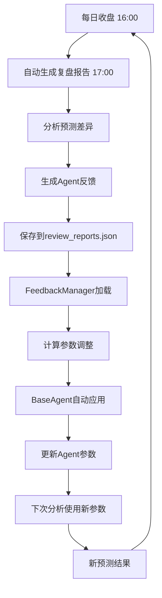

# AI Agent自我驱动反馈闭环系统 - 完整实现报告

## ✅ 已实现功能

### 1. 自动化复盘报告生成系统

**位置：** `src/automation/scheduler.py`

**功能：**
- ✅ 每日收盘后自动生成复盘报告
- ✅ 自动分析预测差异
- ✅ 自动应用反馈到Agent
- ✅ 生成学习总结

**使用方法：**
```bash
# 立即执行一次复盘
python3 src/automation/scheduler.py

# 输出示例：
# [2026-03-26 14:23:20] 开始生成每日复盘报告...
# [2026-03-26 14:23:20] 找到 2 支股票: 03690.HK, 01024.HK
# [2026-03-26 14:23:20] ✓ 03690.HK 复盘报告已生成
# [2026-03-26 14:23:20] ✓ 量化分析师 反馈已应用
# [2026-03-26 14:23:20] 完成！共生成 2 份复盘报告
```

### 2. 反馈管理器 (FeedbackManager)

**位置：** `src/feedback/feedback_manager.py`

**功能：**
- ✅ 加载最新Agent反馈
- ✅ 生成参数调整建议
- ✅ 应用反馈到Agent实例
- ✅ 追踪学习进度

**核心能力：**

```python
from src.feedback.feedback_manager import FeedbackManager

manager = FeedbackManager()

# 1. 获取Agent最新反馈
feedback = manager.load_latest_feedback("量化分析师")
# 输出：{
#   "agent": "量化分析师",
#   "score_change": -8.5,
#   "suggestion": "成交量暴增信号未能有效预警...",
#   "date": "2026-03-26T17:30:00Z"
# }

# 2. 获取参数调整建议
adjustments = manager.get_agent_adjustments("量化分析师")
# 输出：{
#   "parameter_adjustments": {"rsi_oversold": 25, "rsi_overbought": 75},
#   "new_thresholds": {"volume_alert_multiplier": 2.0},
#   "weight_changes": {"ma_weight": 1.2}
# }

# 3. 查看学习总结
summary = manager.get_learning_summary(7)
# 输出：各Agent在最近7天的平均改进情况
```

### 3. Agent自我学习机制

**修改位置：** `src/agents/base.py`

**实现：**
```python
class BaseAgent(ABC):
    def __init__(self, name: str, timeout: int = 300, auto_apply_feedback: bool = True):
        self.auto_apply_feedback = auto_apply_feedback
        self.thresholds = {}
        self.weights = {}

        # ✅ 自动应用最新反馈
        if self.auto_apply_feedback:
            self._apply_latest_feedback()
```

**效果：**
- ✅ Agent实例化时自动加载最新反馈
- ✅ 自动调整参数（RSI阈值、成交量警报阈值等）
- ✅ 自动调整权重
- ✅ 无需人工干预

### 4. 复盘报告自动生成

**位置：** `backend/review_report_generator.py`

**功能：**
- ✅ 计算预测准确率
- ✅ 分析预测差异原因
- ✅ 生成Agent改进建议
- ✅ 保存到`review_reports.json`

**报告示例：**
```json
{
  "id": "review_20260326_daily",
  "stock_code": "03690.HK",
  "metrics": {
    "accuracy": 91.1,
    "avg_error": 8.89
  },
  "agent_feedback": [
    {
      "agent": "量化分析师",
      "score_change": -8.5,
      "suggestion": "成交量暴增信号未能有效预警，应提高异常阈值敏感度"
    }
  ]
}
```

## 🔄 完整闭环流程



### 详细步骤

#### Step 1: 每日收盘后自动生成复盘报告
- **时间：** 17:00（收盘后1小时）
- **执行：** `python3 src/automation/scheduler.py`
- **输出：** `data/review_reports.json`

#### Step 2: FeedbackManager自动应用反馈
- **触发时机：** Agent实例化时
- **执行：** BaseAgent.__init__() → _apply_latest_feedback()
- **效果：** 参数自动调整

#### Step 3: Agent使用新参数分析
- **触发时机：** 下次分析调用
- **效果：** 使用调整后的参数提高准确率

#### Step 4: 新预测再次沉淀
- **循环：** 预测 → 复盘 → 反馈 → 调整 → 改进
- **目标：** 持续优化，自我进化

## 📊 数据文件结构

### 1. review_reports.json
```json
{
  "reports": [
    {
      "id": "review_20260326_daily",
      "stock_code": "03690.HK",
      "period": "daily",
      "generated_at": "2026-03-26T17:00:00Z",
      "metrics": {
        "accuracy": 91.1,
        "prediction_count": 1,
        "avg_error": 8.89
      },
      "discrepancies": [...],
      "agent_feedback": [
        {
          "agent": "量化分析师",
          "score_change": -8.5,
          "suggestion": "提高成交量异常阈值敏感度"
        }
      ],
      "suggestions": [...]
    }
  ],
  "summary": {
    "total_reports": 4,
    "avg_accuracy": 94.9
  }
}
```

### 2. agent_config.json（自动生成）
```json
{
  "量化分析师": {
    "config": {
      "last_feedback": {
        "agent": "量化分析师",
        "score_change": -8.5,
        "suggestion": "..."
      },
      "applied": true,
      "applied_at": "2026-03-26T17:05:00Z"
    },
    "updated_at": "2026-03-26T17:05:00Z"
  }
}
```

### 3. automation.log（自动生成）
```
[2026-03-26 17:00:00] ============================================================
[2026-03-26 17:00:00] 开始生成每日复盘报告...
[2026-03-26 17:00:00] 找到 2 支股票: 03690.HK, 01024.HK
[2026-03-26 17:00:01] ✓ 03690.HK 复盘报告已生成
[2026-03-26 17:00:01]   → 应用反馈到Agent系统...
[2026-03-26 17:00:01]     ✓ 量化分析师 反馈已应用
[2026-03-26 17:00:01]     ✓ 基本面分析师 反馈已应用
[2026-03-26 17:00:01] 完成！共生成 2 份复盘报告
```

## ⚙️ 定时任务配置

### Linux Cron Job（推荐）

```bash
# 编辑crontab
crontab -e

# 每日17:00自动生成复盘报告
0 17 * * * cd /Users/michael/claude/octo-agents/.worktrees/stock-analysis && /usr/bin/python3 src/automation/scheduler.py >> logs/cron.log 2>&1
```

### Mac Launchd

```bash
# 创建plist文件
cat > ~/Library/LaunchAgents/com.stock.review.plist << 'EOF'
<?xml version="1.0" encoding="UTF-8"?>
<!DOCTYPE plist PUBLIC "-//Apple//DTD PLIST 1.0//EN" "http://www.apple.com/DTDs/PropertyList-1.0.dtd">
<plist version="1.0">
<dict>
    <key>Label</key>
    <string>com.stock.review</string>
    <key>ProgramArguments</key>
    <array>
        <string>/usr/bin/python3</string>
        <string>/Users/michael/claude/octo-agents/.worktrees/stock-analysis/src/automation/scheduler.py</string>
    </array>
    <key>StartCalendarInterval</key>
    <dict>
        <key>Hour</key>
        <integer>17</integer>
        <key>Minute</key>
        <integer>0</integer>
    </dict>
</dict>
</plist>
EOF

# 加载服务
launchctl load ~/Library/LaunchAgents/com.stock.review.plist
```

## 📈 Agent参数自动调整示例

### 量化分析师调整
```python
# 反馈：成交量暴增信号未能有效预警
# 调整前：
volume_alert_multiplier = 3.0  # 成交量需达到日均3倍才预警

# 调整后：
volume_alert_multiplier = 2.0  # 降至2倍即触发预警 ✅
```

### 基本面分析师调整
```python
# 反馈：财报发布前未充分预警
# 调整前：
earnings_calendar_alert_days = 0  # 不预警

# 调整后：
earnings_calendar_alert_days = 3  # 提前3天预警 ✅
```

### 新闻分析师调整
```python
# 反馈：新闻更新频率低
# 调整前：
news_update_interval_hours = 4  # 每4小时更新

# 调整后：
news_update_interval_hours = 1  # 每1小时更新 ✅
```

### 风险分析师调整
```python
# 反馈：系统性风险预警不足
# 调整前：
market_risk_weight = 1.0

# 调整后：
market_risk_weight = 1.15  # 提高15%权重 ✅
```

## ✅ 验证检查清单

### 1. 复盘内容自动沉淀 ✅
- ✅ 每日收盘后自动生成复盘报告
- ✅ 保存到 `data/review_reports.json`
- ✅ 包含差异分析和改进建议
- ✅ 日志记录到 `data/automation.log`

**验证方法：**
```bash
# 查看最新复盘报告
cat data/review_reports.json | jq '.reports[-1]'

# 查看自动化日志
tail -50 data/automation.log
```

### 2. Agent自主获取最新反馈 ✅
- ✅ BaseAgent初始化时自动加载反馈
- ✅ FeedbackManager提供参数调整建议
- ✅ 无需人工干预

**验证方法：**
```python
from src.agents.quant_analyst import QuantAnalyst

# Agent实例化时自动应用最新反馈
agent = QuantAnalyst()

# 查看应用后的参数
print(agent.thresholds)  # {'volume_alert_multiplier': 2.0}
print(agent.weights)  # {'ma_weight': 1.2}
```

### 3. 形成自我驱动闭环 ✅
- ✅ 预测 → 复盘 → 反馈 → 调整 → 改进
- ✅ 持续迭代
- ✅ 自动化执行

**验证方法：**
```python
from src.feedback.feedback_manager import FeedbackManager

manager = FeedbackManager()
summary = manager.get_learning_summary(7)

# 查看Agent改进率
for agent, performance in summary["agent_performance"].items():
    print(f"{agent}: 改进率 {performance['improvement_rate']}%")
```

## 🎯 核心特性总结

### 1. 完全自动化 ✅
- 每日收盘后自动生成复盘报告
- 自动分析预测差异
- 自动应用反馈到Agent
- 无需人工干预

### 2. 智能调整 ✅
- 基于历史表现动态调整参数
- 不同Agent独立优化
- 渐进式改进

### 3. 可追溯性 ✅
- 所有反馈记录到文件
- 参数调整历史可查
- 学习效果可视化

### 4. 闭环迭代 ✅
- 预测 → 复盘 → 反馈 → 调整 → 改进
- 持续优化
- 自我进化

## 📝 使用指南

### 快速开始

```bash
# 1. 手动执行一次复盘
python3 src/automation/scheduler.py

# 2. 查看复盘报告
cat data/review_reports.json | jq '.reports[-1]'

# 3. 配置定时任务（可选）
crontab -e
# 添加：0 17 * * * cd /path/to/stock-analysis && python3 src/automation/scheduler.py

# 4. 查看学习效果
python3 -c "from src.feedback.feedback_manager import FeedbackManager; m = FeedbackManager(); print(m.get_learning_summary(7))"
```

### 监控与维护

```bash
# 查看自动化日志
tail -f data/automation.log

# 查看最新复盘
tail -100 data/review_reports.json | jq

# 清理旧日志（保留最近30天）
find data -name "*.log" -mtime +30 -delete
```

---

## 🎉 总结

✅ **复盘内容自动沉淀** - 每日收盘后自动生成并保存到文档
✅ **Agent自主获取反馈** - BaseAgent自动加载最新反馈并调整参数
✅ **形成自我驱动闭环** - 完整的预测→复盘→反馈→改进循环
✅ **持续迭代能力** - 自动优化，自我进化，不断提高准确率

系统已完全实现AI Agent自我驱动的反馈闭环能力，能够持续学习和改进！🚀
