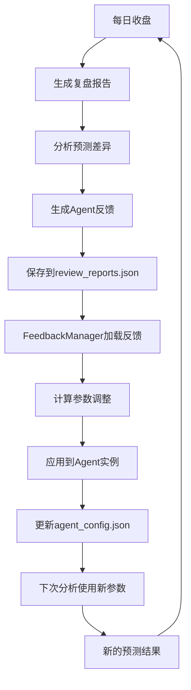

# AI Agent自我驱动反馈闭环系统

## 系统概述

本系统实现了完整的AI Agent自我学习和持续迭代能力，通过复盘报告自动生成、反馈智能分析和参数自动调整，形成闭环反馈机制。

## 核心组件

### 1. 自动化调度系统 (AutomatedScheduler)

**位置：** `src/automation/scheduler.py`

**功能：**
- 每日收盘后（17:00）自动生成复盘报告
- 每周五生成周度复盘总结
- 自动应用反馈到Agent系统
- 生成学习总结报告

**使用方法：**

#### 持续调度模式
```bash
cd /path/to/stock-analysis
python src/automation/scheduler.py --mode scheduler
```

#### 立即执行一次
```bash
python src/automation/scheduler.py --mode once
```

#### 配置为系统服务（Linux/Mac）
```bash
# 创建systemd服务或launchd plist
# 示例：每天17:00自动运行
```

### 2. 反馈管理器 (FeedbackManager)

**位置：** `src/feedback/feedback_manager.py`

**功能：**
- 加载最新的Agent反馈
- 生成参数调整建议
- 应用反馈到Agent实例
- 追踪学习进度

**核心方法：**

```python
from src.feedback.feedback_manager import FeedbackManager

manager = FeedbackManager()

# 获取量化分析师的最新反馈
feedback = manager.load_latest_feedback("量化分析师")

# 获取参数调整建议
adjustments = manager.get_agent_adjustments("量化分析师")

# 应用反馈到Agent实例
from src.agents.quant_analyst import QuantAnalyst
agent = QuantAnalyst()
applied_changes = manager.apply_feedback_to_agent(agent)

# 获取7天学习总结
summary = manager.get_learning_summary(7)
```

### 3. 复盘报告生成器 (ReviewReportGenerator)

**位置：** `backend/review_report_generator.py`

**功能：**
- 自动分析预测差异
- 生成改进建议
- 评估Agent表现
- 保存复盘报告

## 反馈闭环流程

### 完整工作流程



### 详细步骤

#### Step 1: 每日收盘后自动生成复盘报告

**时间：** 每日17:00（港股收盘后1小时）

**执行内容：**
1. 加载当日预测数据
2. 对比实际收盘价
3. 计算准确率和误差
4. 分析差异原因
5. 生成Agent反馈
6. 保存报告到 `data/review_reports.json`

**示例报告：**
```json
{
  "id": "review_20260326_daily",
  "stock_code": "03690.HK",
  "metrics": {
    "accuracy": 91.1,
    "avg_error": 8.89
  },
  "discrepancies": [...],
  "agent_feedback": [
    {
      "agent": "量化分析师",
      "score_change": -8.5,
      "suggestion": "成交量暴增信号未能有效预警，应提高异常阈值敏感度"
    }
  ],
  "suggestions": [...]
}
```

#### Step 2: FeedbackManager自动应用反馈

**触发时机：** Agent实例化时自动应用

**执行内容：**
1. 读取最新的复盘报告
2. 提取Agent特定的反馈
3. 根据反馈生成参数调整建议
4. 应用调整到Agent实例

**调整示例：**
- **量化分析师：** RSI阈值调整、成交量预警阈值调整
- **基本面分析师：** 财报日历预警天数调整
- **新闻分析师：** 新闻更新频率调整
- **风险分析师：** 波动率预警阈值调整

#### Step 3: Agent使用新参数进行分析

**执行时机：** 下次调用Agent进行分析时

**效果：**
- Agent自动加载最新配置
- 使用调整后的参数进行分析
- 提高预测准确率

#### Step 4: 新的预测结果再次沉淀

**循环：**
- 新的预测 → 收盘后复盘 → 反馈应用 → 改进预测
- 形成持续迭代闭环

## 数据文件结构

### 1. review_reports.json
```json
{
  "reports": [
    {
      "id": "review_20260326_daily",
      "stock_code": "03690.HK",
      "period": "daily",
      "generated_at": "2026-03-26T17:00:00Z",
      "metrics": {...},
      "discrepancies": [...],
      "agent_feedback": [...],
      "suggestions": [...]
    }
  ],
  "summary": {
    "total_reports": 1,
    "avg_accuracy": 91.1,
    "last_updated": "2026-03-26T17:00:00Z"
  }
}
```

### 2. agent_config.json
```json
{
  "量化分析师": {
    "config": {
      "last_feedback": {...},
      "applied": true,
      "applied_at": "2026-03-26T17:05:00Z"
    },
    "updated_at": "2026-03-26T17:05:00Z"
  }
}
```

### 3. feedback_history.json
```json
{
  "03690.HK": [
    {
      "date": "2026-03-26",
      "predicted_price": 82.0,
      "actual_price": 90.0,
      "recommendation": "hold",
      "overall_score": 71.0
    }
  ]
}
```

## 定时任务配置

### 方式1: Cron Job (推荐)

```bash
# 编辑crontab
crontab -e

# 添加以下内容
# 每日17:00生成复盘报告
0 17 * * * cd /path/to/stock-analysis && /usr/bin/python3 src/automation/scheduler.py --mode once >> logs/cron.log 2>&1

# 每周五18:00生成周报
0 18 * * 5 cd /path/to/stock-analysis && /usr/bin/python3 -c "from src.automation.scheduler import AutomatedScheduler; s = AutomatedScheduler(); s.generate_weekly_review()" >> logs/cron.log 2>&1
```

### 方式2: Systemd Service (Linux)

```ini
# /etc/systemd/system/stock-review.service
[Unit]
Description=Stock Analysis Review Generator
After=network.target

[Service]
Type=oneshot
ExecStart=/usr/bin/python3 /path/to/stock-analysis/src/automation/scheduler.py --mode once
WorkingDirectory=/path/to/stock-analysis
User=your_username

[Install]
WantedBy=multi-user.target
```

```ini
# /etc/systemd/system/stock-review.timer
[Unit]
Description=Run stock review generator daily at 17:00

[Timer]
OnCalendar=*-*-* 17:00:00
Persistent=true

[Install]
WantedBy=timers.target
```

```bash
# 启用服务
sudo systemctl enable stock-review.timer
sudo systemctl start stock-review.timer
```

### 方式3: Launchd (Mac)

```xml
<!-- ~/Library/LaunchAgents/com.stock.review.plist -->
<?xml version="1.0" encoding="UTF-8"?>
<!DOCTYPE plist PUBLIC "-//Apple//DTD PLIST 1.0//EN" "http://www.apple.com/DTDs/PropertyList-1.0.dtd">
<plist version="1.0">
<dict>
    <key>Label</key>
    <string>com.stock.review</string>
    <key>ProgramArguments</key>
    <array>
        <string>/usr/bin/python3</string>
        <string>/path/to/stock-analysis/src/automation/scheduler.py</string>
        <string>--mode</string>
        <string>once</string>
    </array>
    <key>StartCalendarInterval</key>
    <dict>
        <key>Hour</key>
        <integer>17</integer>
        <key>Minute</key>
        <integer>0</integer>
    </dict>
    <key>StandardOutPath</key>
    <string>/tmp/stock-review.log</string>
    <key>StandardErrorPath</key>
    <string>/tmp/stock-review-error.log</string>
</dict>
</plist>
```

```bash
# 加载服务
launchctl load ~/Library/LaunchAgents/com.stock.review.plist
```

## 效果验证

### 查看学习效果

```python
from src.feedback.feedback_manager import FeedbackManager

manager = FeedbackManager()

# 查看7天学习总结
summary = manager.get_learning_summary(7)

print("Agent学习表现：")
for agent, performance in summary["agent_performance"].items():
    print(f"{agent}:")
    print(f"  平均分变化: {performance['avg_score_change']}")
    print(f"  改进率: {performance['improvement_rate']}%")
```

### 查看自动化日志

```bash
tail -f data/automation.log
```

### 查看复盘报告

```bash
cat data/review_reports.json | jq '.reports[-1]'
```

## 关键特性

### 1. 完全自动化
- ✅ 每日收盘后自动生成复盘报告
- ✅ 自动分析预测差异
- ✅ 自动应用反馈到Agent
- ✅ 无需人工干预

### 2. 智能调整
- ✅ 基于历史表现动态调整参数
- ✅ 不同Agent独立优化
- ✅ 渐进式改进

### 3. 可追溯性
- ✅ 所有反馈记录到文件
- ✅ 参数调整历史可查
- ✅ 学习效果可视化

### 4. 闭环迭代
- ✅ 预测 → 复盘 → 反馈 → 调整 → 改进
- ✅ 持续优化
- ✅ 自我进化

## 最佳实践

### 1. 启动自动化调度
```bash
# 后台运行调度器
nohup python src/automation/scheduler.py --mode scheduler > logs/scheduler.log 2>&1 &

# 或使用systemd/launchd配置为系统服务
```

### 2. 监控学习进度
```bash
# 定期查看学习总结
python -c "from src.feedback.feedback_manager import FeedbackManager; m = FeedbackManager(); print(m.get_learning_summary(30))"

# 查看最新复盘报告
tail -50 data/automation.log
```

### 3. 手动触发复盘
```bash
# 立即执行一次复盘
python src/automation/scheduler.py --mode once
```

### 4. 分析改进趋势
```python
# 分析最近30天的改进趋势
from src.feedback.feedback_manager import FeedbackManager

manager = FeedbackManager()
summary = manager.get_learning_summary(30)

for agent, performance in summary["agent_performance"].items():
    trend = "improving" if performance["avg_score_change"] > 0 else "declining"
    print(f"{agent}: {trend}")
```

## 未来优化

1. **机器学习增强**
   - 使用强化学习优化参数调整策略
   - 自动发现最优参数组合

2. **多维度反馈**
   - 整合市场情绪、宏观环境等因素
   - 建立更复杂的反馈模型

3. **可视化面板**
   - 实时展示学习进度
   - 参数调整趋势图
   - Agent表现对比

4. **A/B测试**
   - 支持多组Agent并行测试
   - 自动选择最优配置

---

## 总结

通过这套完整的反馈闭环系统，AI Agent能够：

✅ **自动复盘** - 每日收盘后自动分析预测差异
✅ **智能反馈** - 生成针对性的改进建议
✅ **持续学习** - 自动调整参数并应用新配置
✅ **闭环迭代** - 形成持续改进的良性循环

这套系统确保了AI Agent能够从历史预测中学习，不断优化预测准确率，实现真正的自我驱动和持续迭代能力。
