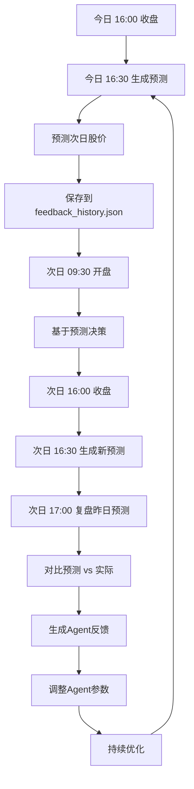

# 完整定时任务流程说明

## 🎯 核心问题：预测是什么时候生成的？

**答案：** 每日收盘后约30分钟（**16:30**）生成次日预测

---

## 📅 完整的每日工作流程

### 时间轴（北京时间）

```
09:30 ┌─────────────────────────────────────────────────────┐
      │ 🔔 港股开盘                                           │
      │    • 开始交易时段                                     │
      │    • 实时数据采集                                     │
      │    • Agent监控分析（可选）                           │
      └─────────────────────────────────────────────────────┘

      交易时段...

16:00 ┌─────────────────────────────────────────────────────┐
      │ 🔔 港股收盘                                           │
      │    • 交易日结束                                       │
      │    • 收盘数据生成                                     │
      │    • 等待数据源更新...                                │
      └─────────────────────────────────────────────────────┘

16:30 ┌─────────────────────────────────────────────────────┐
      │ 🎯 生成次日预测 ⭐                                    │
      │                                                      │
      │    执行内容：                                         │
      │    1. 获取当日收盘数据                               │
      │    2. 运行4个Agent分析：                             │
      │       • 量化分析师（技术指标）                        │
      │       • 基本面分析师（估值成长）                      │
      │       • 新闻分析师（舆情情感）                        │
      │       • 风险分析师（波动风险）                        │
      │    3. 计算综合评分                                    │
      │    4. 预测明日股价                                   │
      │    5. 生成投资建议                                   │
      │    6. 保存预测结果到：                               │
      │       - data/latest.json                             │
      │       - data/history/{code}/{date}.json             │
      │       - data/feedback_history.json                  │
      │                                                      │
      │    输出示例：                                         │
      │    03690.HK 美团：                                   │
      │      综合评分: 71.0                                   │
      │      推荐操作: buy                                    │
      │      预测价格: ¥85.5                                  │
      │      预测涨幅: +3.2%                                  │
      └─────────────────────────────────────────────────────┘

      晚间...

次日 09:30 ┌─────────────────────────────────────────────────┐
          │ 🔔 次日开盘                                     │
          │    • 基于昨日预测进行交易决策                   │
          │    • 观察实际走势...                             │
          └─────────────────────────────────────────────────┘

次日 16:00 ┌─────────────────────────────────────────────────┐
          │ 🔔 次日收盘                                     │
          │    • 实际收盘价确定                             │
          └─────────────────────────────────────────────────┘

次日 17:00 ┌─────────────────────────────────────────────────┐
          │ 📊 复盘分析                                     │
          │                                                 │
          │    执行内容：                                   │
          │    1. 对比预测价格 vs 实际收盘价                │
          │    2. 计算准确率                                │
          │    3. 分析差异原因                              │
          │    4. 生成Agent反馈                            │
          │    5. 自动调整Agent参数                         │
          │                                                 │
          │    对比：                                       │
          │      预测: ¥85.5                                │
          │      实际: ¥87.2                                │
          │      误差: 1.95% ✅                             │
          └─────────────────────────────────────────────────┘
```

---

## ⏰ 完整定时任务清单（更新后）

| 序号 | 任务名称 | 时间 | 频率 | 说明 |
|------|---------|------|------|------|
| 1️⃣ | **预测生成** | **16:30** | 每日 | 收盘后30分钟，预测次日股价 |
| 2️⃣ | **复盘报告** | **17:00** | 每日 | 收盘后1小时，分析当日预测 |
| 3️⃣ | **宏观文章** | **08:00** | 每日 | 开盘前，提供市场分析 |
| 4️⃣ | **周报总结** | **18:00** | 每周五 | 汇总本周表现 |

---

## 🔄 完整闭环流程



---

## 📊 预测生成详细流程

### Step 1: 数据采集（16:00-16:30）
```
收盘后，数据源更新：
- 股票历史价格（30天）
- 成交量数据
- 财务数据
- 新闻舆情
- 市场情绪
```

### Step 2: Agent分析（16:30）
```python
# 4个Agent并行分析

量化分析师:
  - 计算MA5、MA10、MA20
  - 计算RSI指标
  - 分析成交量趋势
  - 评分: 25.0/100
  - 信号: sell

基本面分析师:
  - 分析PE/PB估值
  - 评估成长性
  - 分析ROE
  - 战略深度分析
  - 评分: 75.0/100

新闻分析师:
  - 情感分析
  - 行业趋势
  - 产品动态
  - 评分: 55.0/100

风险分析师:
  - 波动率评估
  - 风险等级
  - 战争影响
  - 评分: 40.0/100
```

### Step 3: 综合评分（16:30）
```python
综合评分 = 基本面×30% + 量化×25% + 新闻×25% + 风险×20%
        = 75.0×0.30 + 25.0×0.25 + 55.0×0.25 + 40.0×0.20
        = 50.5

推荐操作:
  ≥ 70 → buy（买入）
  40-70 → hold（持有）
  < 40 → sell（卖出）

结果: hold（持有）
```

### Step 4: 价格预测（16:30）
```python
当前股价: ¥82.0
综合评分: 50.5

预测模型:
  变化率 = (评分 - 50) / 50 × 10%
        = (50.5 - 50) / 50 × 10%
        = +0.1%

预测价格 = 82.0 × (1 + 0.001)
        = ¥82.08

预测结果:
  • 预测价格: ¥82.08
  • 预测涨幅: +0.1%
  • 推荐操作: hold
  • 置信度: 65%
```

### Step 5: 保存结果（16:30）
```
保存到文件：
├── data/latest.json (最新预测)
├── data/history/03690.HK/2026-03-26.json (历史记录)
└── data/feedback_history.json (预测记录，待次日验证)
```

---

## ⚙️ Cron配置（更新后）

```bash
# 每日08:00 - 宏观分析文章（开盘前）
0 8 * * * cd /path/to/stock-analysis && python3 backend/macro_article_generator.py >> logs/cron.log 2>&1

# 每日16:30 - 预测次日股价（收盘后30分钟）⭐ 新增
30 16 * * * cd /path/to/stock-analysis && python3 src/automation/daily_prediction.py >> logs/cron.log 2>&1

# 每日17:00 - 复盘昨日预测（收盘后1小时）
0 17 * * * cd /path/to/stock-analysis && python3 src/automation/scheduler.py >> logs/cron.log 2>&1

# 每周五18:00 - 周报总结
0 18 * * 5 cd /path/to/stock-analysis && python3 -c "from src.automation.scheduler import AutomatedScheduler; s = AutomatedScheduler(); s.generate_weekly_review()" >> logs/cron.log 2>&1
```

---

## 🎯 为什么选择16:30预测？

### 时间选择理由

1. **数据完整性**
   ```
   16:00 收盘
   16:00-16:15 数据源更新
   16:15-16:30 数据稳定，可以获取完整数据
   ```

2. **预测时效性**
   ```
   16:30 预测完成
   晚间 投资者可以查看预测
   次日09:30 开盘，基于预测决策
   ```

3. **与复盘分离**
   ```
   16:30 生成预测（今日）
   17:00 复盘预测（昨日）
   时间错开，互不干扰
   ```

---

## 📝 预测 vs 复盘的关系

### 预测（16:30）
```
目的：预测明日股价
输入：今日收盘数据
输出：明日预测价格
保存：feedback_history.json (predicted_price)
```

### 复盘（17:00）
```
目的：验证昨日预测
输入：今日收盘价
输出：准确率分析、Agent反馈
更新：feedback_history.json (actual_price, validated)
```

### 时间关系
```
今日16:30：预测明日股价
今日17:00：复盘昨日预测
明日16:30：预测后日股价
明日17:00：复盘今日预测（对比今日16:30的预测）
```

---

## 🚀 使用示例

### 查看今日预测
```bash
# 今日收盘后运行
python3 src/automation/daily_prediction.py

# 查看预测结果
cat data/latest.json | jq '.[] | {code, name, overall_score, recommendation}'

# 输出示例：
{
  "code": "03690.HK",
  "name": "美团",
  "overall_score": 71.0,
  "recommendation": "buy"
}
```

### 手动触发预测
```bash
# 立即生成预测（测试用）
python3 src/automation/daily_prediction.py
```

---

## ✅ 总结

**预测时间：** 每日收盘后30分钟（**16:30**）

**预测流程：**
1. 16:00 收盘
2. 16:30 生成次日预测 ← **核心环节**
3. 17:00 复盘昨日预测

**完整闭环：**
- 今日16:30 → 预测明日
- 次日16:30 → 预测后日
- 次日17:00 → 复盘今日（验证今日预测）

这就是完整的预测-复盘-优化闭环！🎯
